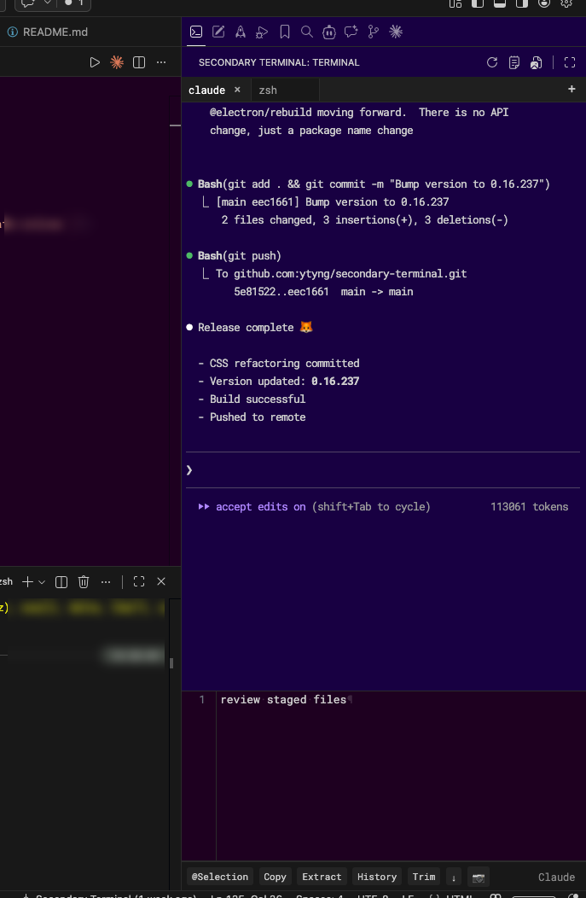

# Secondary Terminal

A full-featured terminal extension that runs in the VSCode sidebar. With complete PTY emulation, interactive applications such as vim and less work correctly.



## Features

- **Sidebar Terminal**: Terminal integrated into the VSCode sidebar
- **Full PTY Emulation**: Genuine pseudo-terminal implementation using Python
- **Interactive App Support**: Full support for vim, less, nano, etc.
- **Dynamic Resizing**: Automatically adjusts terminal size according to sidebar dimensions
- **UTF-8 Support**: Correctly displays multibyte characters including Japanese
- **Custom Font**: RobotoMono Nerd Font support
- **Multi-Tab Support**: Multiple independent terminal tabs, each with its own shell process and editor
- **ACE Editor Integration**: Built-in code editor (ACE) per tab for composing commands and text
- **Clipboard Image Paste**: Paste images from clipboard and insert file path reference (macOS only)
- **Drop Zone**: Drag & drop files from the explorer to insert file path references into the editor

## Requirements

- Visual Studio Code 1.101.0 or later
- Python 3.x (for PTY emulation)
- macOS / Linux (currently only Unix-based OS supported)

## Installation

### Development Installation

1. Clone this repository:
   ```bash
   git clone <repository-url>
   cd secondary-terminal
   ```

2. Install dependencies:
   ```bash
   npm install
   ```

3. Compile TypeScript:
   ```bash
   npm run compile
   ```

4. Run in development mode with VSCode:
   - Open the project in VSCode
   - Press F5 to launch the extension in debug mode
   - A new VSCode window will open with the extension available

### Local Installation

To install the extension to your local VSCode, copy the project directory path, then open the Command Palette (Cmd+Shift+P) and run:

```
Developer: Install Extension from Location...
```

Specify the project directory path (e.g., `/path/to/secondary-terminal`).

### Installation via Symlink

As a simpler alternative, you can create a symbolic link in the extensions directory:

```bash
# For standard VSCode
ln -s /path/to/secondary-terminal ~/.vscode/extensions/secondary-terminal

# For VSCode Insiders
ln -s /path/to/secondary-terminal ~/.vscode-insiders/extensions/secondary-terminal
```

Then restart VSCode.

### Updating After Code Changes

Steps to update after modifying the extension code:

1. **Compile TypeScript**:
   ```bash
   npm run compile
   # Or watch for changes and auto-compile
   npm run dev
   ```

2. **Reload the extension in VSCode**:
   - Open the Command Palette (Cmd+Shift+P)
   - Run `Developer: Reload Window`
   - Or fully restart VSCode

3. **Test in development mode**:
   - Open the project in VSCode
   - Press F5 to launch in debug mode
   - Test your changes in the new window

### Development Commands

```bash
# Auto-compile (file watcher)
npm run dev

# Clean output directory
npm run clean

# Clean and recompile
npm run rebuild

# Lint code
npm run lint
```

## Usage

1. After installing the extension, restart VSCode
2. A "Secondary Terminal" icon will appear in the sidebar
3. Click the icon to open the terminal panel
4. Use it like a regular terminal:
   - Execute commands
   - Edit files with vim (hjkl cursor movement supported)
   - Browse files with less
   - Other interactive applications
5. Use the built-in ACE editor to compose multi-line commands and send them to the terminal with `Cmd+Enter`
6. Paste images from clipboard using the 📷 button (macOS) — the image is saved to a temp file and inserted as `[@<filepath>]`
7. Drag & drop files onto the Drop Zone to insert file path references into the editor

## Technical Specifications

- **Frontend**: High-performance terminal emulator using xterm.js
- **Backend**: Full pseudo-terminal implementation using Python's pty module
- **Communication**: Node.js child_process for communication between VSCode and Python
- **Character Encoding**: Full UTF-8 support
- **Shell**: zsh (default), with bash fallback

## Known Issues

- Currently only Unix-based OS (macOS, Linux) supported
- Some advanced terminal features (multiple panes, etc.) are not yet supported
- Does not work on Windows

### Performance Degradation with Large Scroll History
Terminal scrolling and UI responsiveness slow down as scroll history grows. This is a frontend-side issue unrelated to PTY. Rewriting PTY in Rust was attempted but showed no improvement (see feature/rust-pty branch), so the change was reverted.

## Developer Information

### File Structure

- `src/extension.ts`: Extension entry point
- `src/terminalProvider.ts`: Terminal provider implementation (tabs, ACE editor, PTY management)
- `src/clipboardImageHandler.ts`: macOS clipboard image extraction
- `src/dropZoneProvider.ts`: File drag & drop zone
- `src/terminalSessionManager.ts`: Terminal session persistence
- `src/shellProcessManager.ts`: Shell process lifecycle management
- `resources/terminal.html`: Main UI (xterm.js, ACE editor, tab bar)
- `resources/xterm.css`, `resources/xterm.js`: xterm.js library

### Key Features

1. **PTY Emulation**: Full pseudo-terminal implementation via Python script
2. **Dynamic Resizing**: Automatic resize based on HTML element dimensions
3. **Non-blocking I/O**: High-performance I/O processing using select

### Rust PTY Migration Attempt

A Rust-based PTY implementation was attempted to eliminate environment dependencies, but was abandoned due to macOS security restrictions. When spawning a binary located under `/Users/` from Node.js, PTY creation is blocked and the process immediately becomes a zombie. See `resources/pty-rs/README.md` in the feature/rust-pty-migration branch for details.

## License

MIT License

## Author

ytyng
